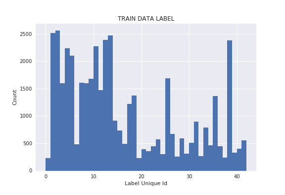
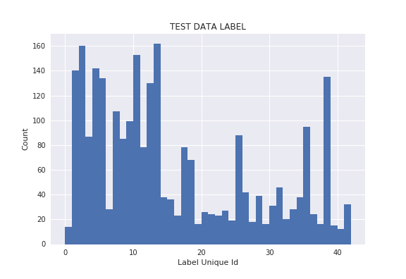
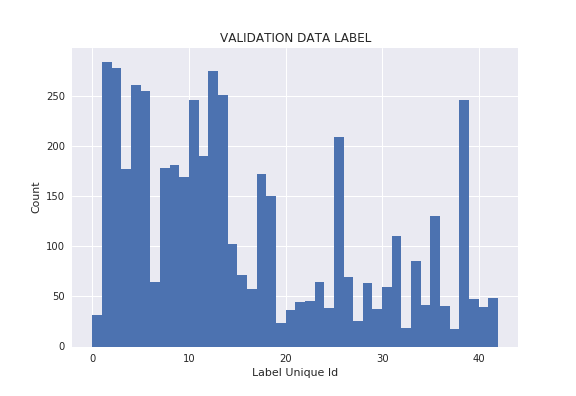
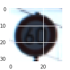
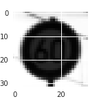
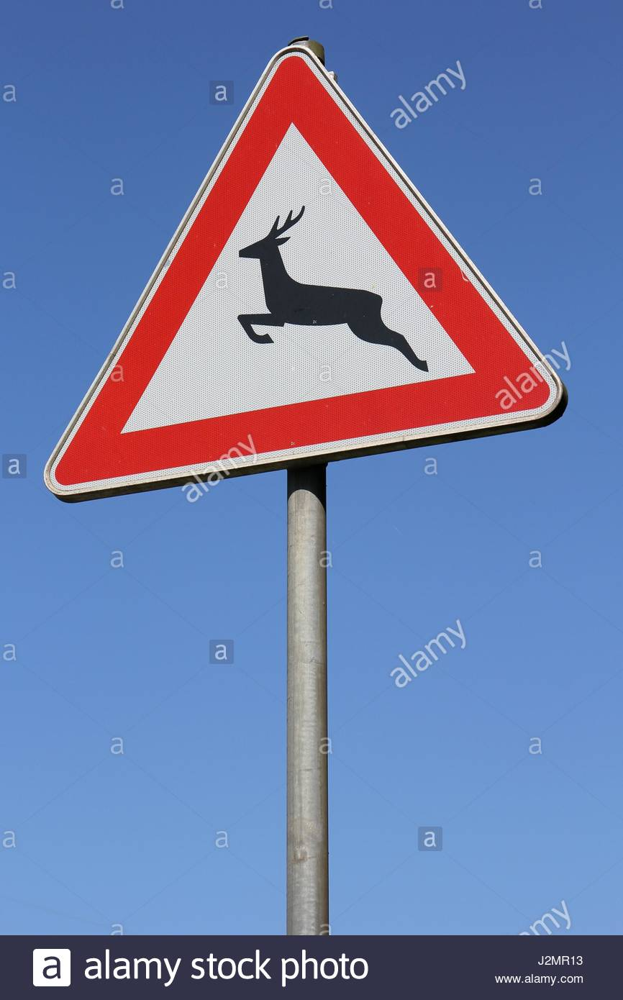
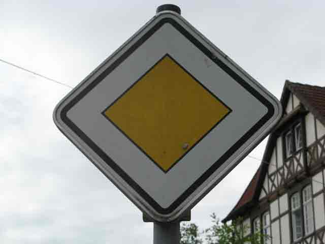

# **Traffic Sign Recognition** 

### Data Set Summary & Exploration

#### 1. Provide a basic summary of the data set. In the code, the analysis should be done using python, numpy and/or pandas methods rather than hardcoding results manually.

I used numpy to explore the characteristics of the data:

* The size of training set is **44322**
* The size of the validation set is **4925**
* The size of test set is: **2592**
* The shape of a traffic sign image is: **32x32x3**
* The number of unique classes/labels in the data set is **42**

I did some investigation on all of the data set (train, validation, test) and found there are some very speicific image on validation and test sets for a sign that does not have any similar example on the train. Therefore, I decided to first merge all the data from three set, then shuffle and re-split them with similar initial ratios. This technique did help to improve might network accuracy a little bit. Also, the distribution of image number between train, test, and validation sets looks very similar even after splitting so I think it would not affect the final result of the network.

#### 2. Include an exploratory visualization of the dataset.

Below is the historams shows the distribution of the data for each type of traffic signs in training, validation and test sets. Each unique traffic sign has label id from 0 to 42.

### Design and Test a Model Architecture

#### 1. Describe how you preprocessed the image data. What techniques were chosen and why did you choose these techniques? Consider including images showing the output of each preprocessing technique. Pre-processing refers to techniques such as converting to grayscale, normalization, etc. (OPTIONAL: As described in the "Stand Out Suggestions" part of the rubric, if you generated additional data for training, describe why you decided to generate additional data, how you generated the data, and provide example images of the additional data. Then describe the characteristics of the augmented training set like number of images in the set, number of images for each class, etc.)

First, convert all data from RGB to grayscale in order to greatly reduce number of unneccessary features so the training time can be faster. The network can then focus on learning the correct pattern from the single feature map.

Second, normalize the pixel value and scale them in between -1 and 1 in order to avoid exploding in gradients and help backpropagation works much better.

#### 2. Describe what your final model architecture looks like including model type, layers, layer sizes, connectivity, etc.) Consider including a diagram and/or table describing the final model.

My final model consisted of the following layers:

| Layer         		|     Description	        					| 
|:---------------------:|:---------------------------------------------:| 
| Input         		| 32x32 Grayscale image   							| 
| Convolution 3x3     	| 1x1 stride, VALID padding, outputs 30x30x64 	|
| BatchNormalization     	|  	|
| RELU					|												|
| Dropout					|			keep probaility: 0.7				|
| Max pooling	      	| 2x2 stride,  outputs 15x15x64 				|
| Convolution 3x3	    | 1x1 stride, VALID padding, outputs 13x13x128					|
| BatchNormalization     	|  	|
| RELU					|												|
| Dropout					|			keep probaility: 0.7				|
| Max pooling	      	| 2x2 stride,  outputs 6x6x128 				|
| Convolution 3x3	    | 1x1 stride, VALID padding, outputs 4x4x256					|
| BatchNormalization     	|  	|
| RELU					|												|
| Dropout					|			keep probaility: 0.7				|
| Max pooling	      	| 2x2 stride,  outputs 2x2x64 				|
| Fully connected		| ouputs 500        									|
| RELU					|												|
| Dropout					|			keep probaility: 0.4				|
| Fully connected		| ouputs 300        									|
| RELU					|												|
| Dropout					|			keep probaility: 0.4				|
| Fully connected		| ouputs 42        									|

#### 3. Describe how you trained your model. The discussion can include the type of optimizer, the batch size, number of epochs and any hyperparameters such as learning rate.

To train the model, I used the **reduce mean** on **softmax crossentropy** as loss function. 
I chose **Adam Optimizer** with learning rate **0.0005**.
I use **batch size** of 32
I use **number of epochs** of 100

I started with learning rate 0.001 however the network did not reach the required accuracy for validation set, therefore I decided to reduce learning rate to 0.0005 in order to help the gradient descent find better optimal points. Later on after adding more layers to the network and the validation accuracy reached the required 93% value. I decided to stick with this learning rate.

#### 4. Describe the approach taken for finding a solution and getting the validation set accuracy to be at least 0.93. Include in the discussion the results on the training, validation and test sets and where in the code these were calculated. Your approach may have been an iterative process, in which case, outline the steps you took to get to the final solution and why you chose those steps. Perhaps your solution involved an already well known implementation or architecture. In this case, discuss why you think the architecture is suitable for the current problem.

My final model results were:
* training set accuracy of **100%**
* validation set accuracy of **98%**
* test set accuracy of **99.2%**

I have been using the iterative process to come up with the final network architecture. Using the LeNet architecture as a starting point, I start increasing number of filters per convolution layers as well as adding more convolution layers to help the network learn more high level features and improve the validation accuracy. In order to help the network converge faster and avoid overfitting, I apply some optimization techniques like batch normalization and dropout between each convolution layers as well as fully connected layers. The keep probability for convolution is at 70% while the keep proablity for fully connected layer is at 60%. These are set back to 100% during inference. The network is trained for 100 epochs and reach 95% accuracy on validation set at the 90th epoch. However, the network reach 98% accuracy on validation set around the 28th epoch so we do not have much improvement from that on. I decided to stop the training at 30th epoch.

### Test a Model on New Images

#### 1. Choose five German traffic signs found on the web and provide them in the report. For each image, discuss what quality or qualities might be difficult to classify.

Here are eight German traffic signs that I found on the web:

#### 2. Discuss the model's predictions on these new traffic signs and compare the results to predicting on the test set. At a minimum, discuss what the predictions were, the accuracy on these new predictions, and compare the accuracy to the accuracy on the test set (OPTIONAL: Discuss the results in more detail as described in the "Stand Out Suggestions" part of the rubric).

Here are the results of the prediction:

| Image			        |     Prediction	        					| 
|:---------------------:|:---------------------------------------------:| 
|Wild animal crossings	     		| Ahead only 									| 
| Pedestrians     			| Road narrows on the right										|
| Slippery Road				| Slippery Road											|
| Road work	      		| Road work					 				|
| Priority Road			| Priority Road      							|
| Keep Right | Keep Right |
| Yield | Yield

The model was able to correctly guess 5 of the 7 traffic signs, which gives an accuracy of 71.4%. This accuracy is a little low in compares with the test set. 

There are multiple reasons for the wrong prediction on each image:
* Number of train, validation data.
* Orientation of the sign (some signs has multiple orientations depends on the driving direction)
* Multiple versions of the same sign.
* Position of the sign in the image.
* Size of the sign in the image

#### 3. Describe how certain the model is when predicting on each of the five new images by looking at the softmax probabilities for each prediction. Provide the top 5 softmax probabilities for each image along with the sign type of each probability. (OPTIONAL: as described in the "Stand Out Suggestions" part of the rubric, visualizations can also be provided such as bar charts)

All the wrong predictions are related to image that have signifcant less data on training set as well as having various orientations related to driving directions.

For the **31.jpg** image which is "Wild and animal crossings" sign, the model predict

| Probability         	|     Prediction	        					| 
|:---------------------:|:---------------------------------------------:| 
| .639         			| Ahead only | 
| .213     				| Turn right ahead|
| .086					| Speed limit (70km/h)|
| .020	      			|Go straight or right|
| .014				    | Road narrows on the right|

This image has less data than the other sign that are correctly predicted. 

Also, this sign has multiple versions for different driving directions and type of animals causing it is hard to be generalized by the network 

For the **27.jpg** image which is "Pedestrians" sign, the model predict

| Probability         	|     Prediction	        					| 
|:---------------------:|:---------------------------------------------:| 
| .316         			| Road narrows on the right  					| 
| .225     				| Road work|
| .093					| Right-of-way at the next intersection|
| .063	      			|Children crossing|
| .060				    |Ahead only|

This image also has less signifcant amount of training data that make the network cannot learn its features well enough. 

For the **23.jpg** image which is "Slippery road" sign, the model predict

| Probability         	|     Prediction	        					| 
|:---------------------:|:---------------------------------------------:| 
| .40        			| Slippery road   									| 
| .138     				| Roundabout mandatory|
| .123					| Dangerous curve to the right|
| .088	      			|Beware of ice/snow|
| .071				    | Right-of-way at the next intersection|

Initially, the network is not able to predict this image correctly also due to the limit number of training data. However, after applying gaussian blur with kernel 3x3, the network is able to guess it correctly although the probability is not as certain as other correct predictions.

For the **13.jpg** image which is "Yield" sign, the model predict

| Probability         	|     Prediction	        					| 
|:---------------------:|:---------------------------------------------:| 
| .398         			| 	Yield| 
| .172     				| Ahead only|
| .073					| Priority road|
| .047	      			|Speed limit (30km/h)|
| .041				    | Speed limit (60km/h)|

For the **25.jpg** image which is "Road work" sign, the model predict

| Probability         	|     Prediction	        					| 
|:---------------------:|:---------------------------------------------:| 
| .927         			| 	Road work| 
| .043     				| Beware of ice/snow|
| .008					| Dangerous curve to the right|
| .006	      			|Right-of-way at the next intersection|
| .003				    | Children crossing|

For the **38.jpg** image which is "Keep right sign, the model predict

| Probability         	|     Prediction	        					| 
|:---------------------:|:---------------------------------------------:| 
| .959         			| 	Keep right| 
| .002     				|Speed limit (50km/h)|
| .001					| Speed limit (30km/h)|
| .0008	      			|	Road work|
| .0008				    | Turn left ahead|

For the **12.jpg** image which is "Priority road" sign, the model predict

| Probability         	|     Prediction	        					| 
|:---------------------:|:---------------------------------------------:| 
| 1         			| Priority road   									| 

